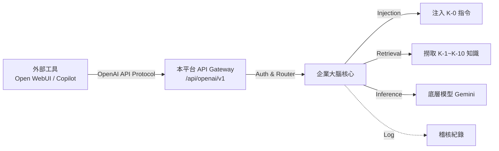
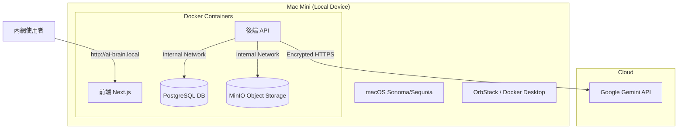
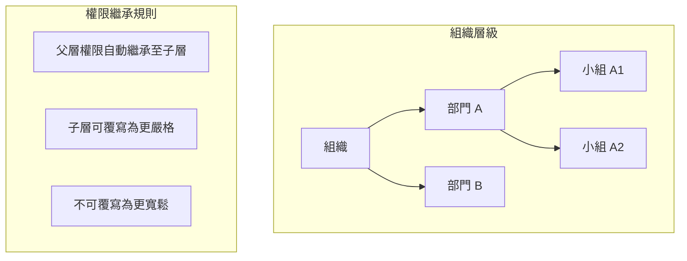
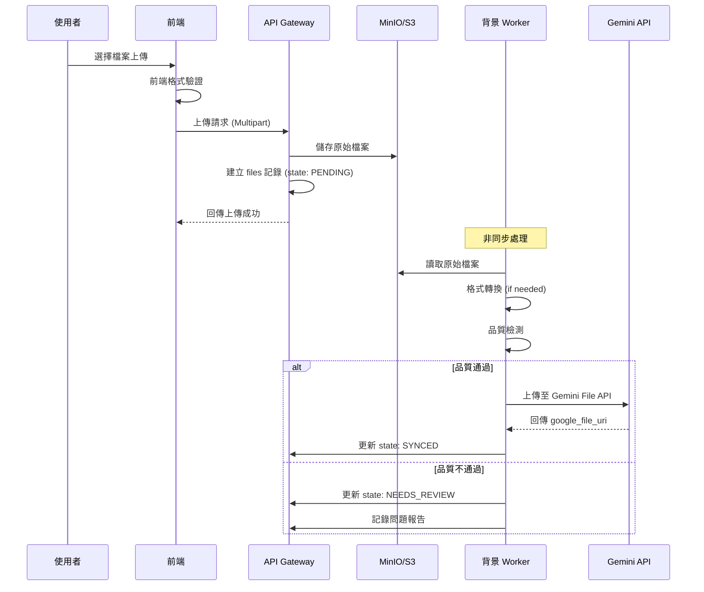
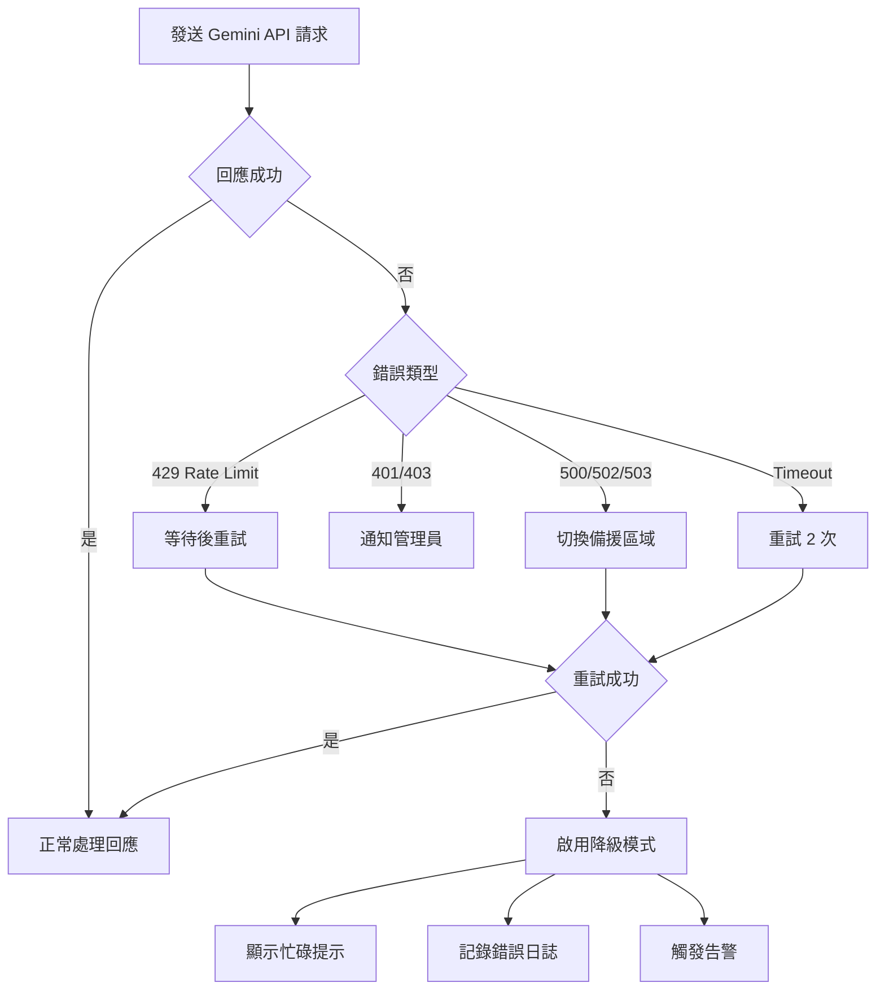

# 企業 AI 知識庫與 Agent 管理平台 - 網站規格書 (System Specification) v1.1

**文件版本：** 1.1
**日期：** 2026-01-01
**專案名稱：** Enterprise AI Knowledge Agent Platform (EAKAP)
**核心技術：** 
1. **Primary Storage**: S3-compatible Object Storage (Generic Source of Truth) - AWS S3 (Cloud) or **MinIO (Local Appliance)**
2. **Runtime Engine**: Google Gemini 1.5/2.0 API (File Search & Gems Concept) with Multi-Model Adapter Design

---

## 1. 專案概述 (Project Overview)

### 1.1 目標 (Vision)
打造一個企業級的「AI Agent 工廠與知識運籌中心」。本平台旨在解決企業導入 AI 時面臨的「知識分散」、「操作標準不一」與「權限失控」三大痛點。
本專案採用 **「Hub and Spoke (軸輻式)」** 架構：以自建儲存為核心 (Hub)，動態同步至各類 AI 模型 (Spoke)。首階段導入 Gemini File Search 技術作為主要運算引擎，但保留未來隨時切換至 OpenAI/Claude 等模型的彈性，確保企業擁有資料主權。

### 1.2 核心價值主張
1.  **集中化知識管理**：單一來源（Single Source of Truth），避免同樣的文件在不同 Agent 間重複上傳且版本不一。
2.  **標準化 Agent 產出**：透過統一的 System Prompt 與強制的知識庫綁定，確保全公司產出品質一致。
3.  **精細化權限控管**：結合 Role-Based Access Control (RBAC) 與標籤系統，確保「對的人用對的 Agent，讀對的資料」。

---

## 2. 系統架構 (System Architecture)

### 2.1 高層次架構圖 (High-Level Design - Hub & Spoke)

```mermaid
graph TD
    User[使用者 (Web)] -->|HTTPS| Frontend[前端 Next.js]
    Frontend -->|API| Backend[後端 API Gateway]
    
    subgraph SovereignZone[企業自有資產區]
        Backend --> Auth[權限管理系統]
        Backend --> AgentMgr[Agent 配置管理器]
        Backend --> KMS[知識庫標籤系統]
        Backend --> DB[(PostgreSQL)]
        Backend --> S3[(S3 Storage)]
    end
    
    subgraph RuntimeGemini[AI 運算層 - Gemini]
        Backend -.->|Sync| G_Storage[Gemini File Storage]
        Backend -->|Generate| G_Model[Gemini Models]
        G_Model <-->|Retrieval| G_Storage
    end
    
    subgraph RuntimeFuture[AI 運算層 - 預留擴展]
        Backend -.->|Sync| O_Vector[OpenAI / Claude]
    end
```

### 2.2 核心流程邏輯 (Dual-Layer Workflow)
1.  **知識上傳 (Hub Layer)**：
    *   文件上傳至平台 → 存入 **Primary Storage (S3)**。
    *   資料庫記錄：`file_id` + `s3_path` + `企業標籤(Tags)` + `權限設定`。
2.  **知識同步 (Spoke Layer)**：
    *   背景任務 (Worker) 觸發：讀取 S3 檔案 → 呼叫 Gemini File API 上傳。
    *   取得 `google_file_uri` → 回寫入資料庫對應欄位。
3.  **Agent 建構**：管理員設定 Prompt + 選擇需要的 `Tags`。
4.  **對話執行 (Runtime)**：
    *   使用者發送訊息。
    *   平台撈出該 Agent 綁定文件的 `google_file_uri` (使用快取層路徑)。
    *   呼叫 Gemini API 進行回答。

### 2.3 外部整合架構 (Enterprise Brain Integration)
本平台作為「Headless Knowledge Service」，提供標準介面供外部工具調用。



*   **相容性**：完全相容 OpenAI Chat Completions API 格式。
*   **透明代理 (Transparent Proxy)**：外部工具只需設定 Base URL 指向本平台，無需感知內部是使用 Gemini 或其他模型。
*   **伺服器端指令注入 (Server-side Prompt Injection)**：System Prompt 與 RAG 邏輯由本平台後端強制執行，外部工具無法繞過。

---

## 3. 使用者角色與權限 (User Roles & Permissions)

| 角色 | 代號 | 權限描述 | 典型使用者 |
| :--- | :--- | :--- | :--- |
| **超級管理員** | `SUPER_ADMIN` | **全能權限**。可管理所有部門、所有 Agent、所有文件、所有人員設定。 | 知識長 (CKO)、IT 主管 |
| **部門管理員** | `DEPT_ADMIN` | **部門級全權**。僅能管理所屬部門的 Agent 與文件。無法看見其他部門資料。 | 部門主管 |
| **知識維護者** | `EDITOR` | **僅維護內容**。可上傳/更新/刪除文件，在聊天室測試 Agent，但**不可修改 Agent 的 System Prompt**。 | 資深員工、專案經理 |
| **一般使用者** | `USER` | **僅使用**。只能與被授權的 Agent 對話。無法接觸後台。 | 一般員工、實習生 |

---

## 4. 功能模組規格 (Functional Requirements)

### 4.1 身份驗證與授權模組 (IAM)
*   **F-01 登入/登出**：支援 Email/Password 登入，預留 SSO (Google/Microsoft Entra ID) 介接空間。
*   **F-02 角色管理**：後台可設定使用者的角色（User/Editor/Admin）與所屬部門（Sales/Marketing/IT）。
*   **F-03 API Key 管理**：系統統一管理 Google Gemini API Key，不讓終端使用者接觸 Key。

### 4.2 知識庫管理系統 (KMS) - "The Brain"
此模組負責管理原本構想中的「15 個資料夾」，但透過**標籤 (Tags)** 讓結構更靈活。

*   **F-04 多格式文件上傳**：
    *   支援格式：PDF, DOCX, XLSX, PPTX, CSV, MD, TXT, HTML。
    *   單檔限制：依照 Gemini API 限制 (通常 2GB 內)，平台可設定較保守限制 (如 100MB) 以優化體驗。
*   **F-05 智慧標籤系統 (Smart Tagging)**：
    *   **架構**：每個檔案可擁有多個標籤。
    *   **強制標籤**：上傳時必須選擇「部門歸屬」(如：行銷部)。
    *   **自訂標籤**：可自訂專案標籤 (如：2025_Q1, 競品分析, 機密等級A)。
*   **F-06 文件版本控制**：
    *   邏輯：同一份文件 (Filename 相同) 再次上傳時，自動封存舊版 `file_uri`，產生新版 `file_uri`，並更新所有綁定此文件的 Agent。
*   **F-07 知識生命週期**：設定文件「有效期限」，過期自動從 Agent 的 Context 中移除（Logical Delete）。

### 4.3 Agent 建構工廠 (Agent Ops) - "The Factory"
*   **F-08 Agent 創建與配置**：
    *   設定名稱、頭像、描述。
    *   **System Prompt 編輯器**：支援版本控制，可隨時回滾舊版指令。
    *   **模型參數**：選擇模型版本 (Gemini 1.5 Flash / Pro)、Temperature (創意度)。
*   **F-09 知識綁定 (Knowledge Binding)**：
    *   **模式 A (資料夾模式)**：直接勾選「行銷部資料夾」，該資料夾下所有檔案自動掛載。
    *   **模式 B (標籤模式)**：設定規則 `Tag == '行銷部' AND Tag == '公關稿'`，未來只要上傳符合此標籤的新檔案，Agent 自動讀取，無須重新設定。
*   **F-10 權限指派**：
    *   設定哪些使用者或部門可以使用這隻 Agent。

### 4.4 前台對話介面 (Chat UI) - "The Interface"
*   **F-11 Agent 選擇大廳**：
    *   根據使用者權限，顯示可用的 Agent 卡片列表。
    *   支援依部門、我的最愛篩選。
*   **F-12 對話視窗**：
    *   類 ChatGPT/Gemini 介面。
    *   支援 Markdown 渲染 (表格、程式碼)。
    *   支援串流輸出 (Streaming) 提升體感速度。
*   **F-13 引用來源顯示 (Citations)**：
    *   **關鍵功能**：當 Agent 回答內容來自知識庫時，必須顯示 `[1]` 引用標記。
    *   點擊標記可展開側邊欄，顯示原始文件名稱與相關段落摘要（即使原始文件是 PPT 圖表也能顯示描述）。

### 4.5 系統管理與稽核 (Admin & Audit)
*   **F-14 使用量儀表板**：顯示 Token 消耗量、最熱門的 Agent、最常被引用的文件。
*   **F-15 操作稽核日誌 (Audit Log)**：
    *   記錄誰 (User) 在何時 (Time) 對哪隻 Agent (Agent ID) 問了什麼 (Prompt) 以及系統回了什麼。
    *   記錄誰 (User) 在何時 (Time) 對哪隻 Agent (Agent ID) 問了什麼 (Prompt) 以及系統回了什麼。
    *   記錄後台的所有修改行為 (文件刪除、權限變更)。

### 4.6 外部整合介面 (OpenAI Bridge)
*   **F-16 OpenAI 相容 API**：
    *   提供 `/api/openai/v1/chat/completions` 端點。
    *   支援 `model` 參數對應至內部的 `agent_id` 或 `agent_name`。
    *   支援 Streaming Response (SSE)。
    *   **權限驗證**：使用平台核發的 API Key (Bearer Token) 進行驗證。

---

## 5. 資料庫設計概念 (Schema Concept)

僅列出核心 Table 結構，使用 PostgreSQL。

```sql
-- 使用者與組織
TABLE users (id, email, password_hash, role, department_id, created_at)
TABLE departments (id, name, description)

-- 知識庫 (Dual-Layer Storage Design)
TABLE files (
  id, 
  filename, 
  
  -- Layer 1: Sovereign Storage (Master Copy)
  s3_storage_path,  -- e.g., "s3://corp-bucket/marketing/2025_plan.pdf"
  s3_etag,          -- Checksum for versioning
  
  -- Layer 2: Runtime Adapters
  gemini_file_uri,  -- 目前使用："https://generativeai.google.com/..."
  gemini_state,     -- "SYNCED", "PROCESSING", "FAILED"
  
  -- Future Proofing (預留欄位)
  openai_file_id,   -- 未來預留
  claude_file_id,   -- 未來預留

  mime_type, 
  size_bytes, 
  uploaded_by, 
  is_active,        -- 版本控制用
  created_at
)

-- 檔案標籤 (多對多)
TABLE file_tags (file_id, tag_key, tag_value)

-- Agent 設定
TABLE agents (
  id, 
  name, 
  system_prompt, 
  model_version, 
  department_id,    -- 歸屬部門
  created_by
)

-- Agent 與知識的關聯 (定義這隻 Agent 能看哪些檔案)
TABLE agent_knowledge_rules (
  agent_id, 
  rule_type,        -- "FOLDER" or "TAG"
  rule_value        -- e.g., "tag:marketing"
)

-- 權限指派 (定義誰能用這隻 Agent)
TABLE agent_access_control (
  agent_id,
  user_id_or_dept_id,
  can_access
)
```

---

## 6. 非功能需求 (Non-functional Requirements)

### 6.1 資料安全性 (Data Security)
*   **傳輸加密**：全站強制 HTTPS (TLS 1.3)。
*   **隔離機制**：透過後端邏輯確保 User A 絕對無法呼叫未授權 Agent 的 API endpoint。
*   **檔案權限**：Google File URI 雖然是公開連結 (需透過 API Key 存取)，但應用層必須做 Proxy 或 Signed URL 機制，不直接暴露 URI 給前端。

### 6.2 效能要求 (Performance)
*   **回應速度**：Agent 首字回應時間 (TTFB) < 2 秒 (透過 Streaming)。
*   **併發量**：支援至少 50 人同時在線對話。

### 6.3 可維護性 (Maintainability)
*   **前後端分離**：確保未來可獨立更換 AI 模型層或前端介面。
*   **後端中立性 (Backend Neutrality)**：
    *   必須使用標準 **Supabase SDK (`@supabase/supabase-js`)** 於後端 API 層進行資料存取。
    *   禁止 Hard-code 資料庫連線字串，必須透過環境變數 (`NEXT_PUBLIC_SUPABASE_URL`) 切換。
    *   目的：確保同一套程式碼可無痛切換 **Supabase Cloud (SaaS模式)** 與 **Self-hosted Supabase (Docker/Mac Mini模式)**。
    *   **架構規範**：所有資料寫入與核心邏輯查詢必須經過 API Gateway，禁止前端直接使用 Supabase Client 操作資料庫，以確保這套系統能完全獨立運作於封閉環境。
*   **Docker 化**：全系統支援 Docker Compose 一鍵部署，方便在私有雲或地端伺服器運行。

---

## 7. 開發時程預估 (Roadmap)

### Phase 1: MVP (此階段目標：讓您能用) - 預計 4 週
*   Week 1: 環境建置 (Next.js + Supabase/Postgres)、Gemini API 串接測試。
*   Week 2: 知識庫上傳功能 (File API)、簡單標籤系統。
*   Week 3: Agent 設定後台 (Prompt + 綁定標籤)、基礎 Chat 介面。
*   Week 4: 基礎權限 (Admin vs User)、整合測試、上線。

### Phase 2: 企業級優化 (此階段目標：好管理) - 預計 4-6 週
*   實作完整的部門權限 (RBAC)。
*   實作引用來源 (Citations) 的前端視覺化。
*   實作稽核日誌與用量統計。

---

## 8. 一體機落地部署指南 (Appliance Deployment Guide - Mac Mini Edition)

本章節詳述如何將 EAKAP 平台封裝為硬體產品交付。

### 8.1 硬體規格建議 (Hardware Query)
*   **機型**：Apple Mac Mini (推薦 M2 或 M4 晶片版本)。
*   **記憶體**：至少 16GB (運行 Docker 流暢度需求)。
*   **儲存**：至少 512GB SSD (存放本地 MinIO 文件庫)。
*   **網路**：Gigabit Ethernet (確保內網傳輸速度)。

### 8.2 本地端軟體堆疊 (Local Software Stack)
在硬體模式下，原本的雲端 S3 將被 **MinIO** 取代，實現完全本地化儲存。



### 8.3 出廠預設流程 (Factory Setup SOP)
**由您的技術團隊在出貨前執行：**

1.  **系統初始化**：
    *   設定 macOS 自動登入、開啟遠端管理 (SSH/VNC)。
    *   設定固定 Hostname (如 `ai-brain`)。
2.  **環境建置**：
    *   安裝 **OrbStack** (比 Docker Desktop 更輕量、效能更好，適合 Mac)。
    *   安裝 Node.js, Python 等 Runtime。
3.  **部署應用**：
    *   將 EAKAP 的 Docker Image 拉取至本地。
    *   設定 `docker-compose.yml` 自動隨開機啟動 (Restart Policy: always)。
    *   初始化 PostgreSQL Schema。
    *   初始化 MinIO Buckets。
4.  **網路廣播設定**：
    *   啟用 mDNS (Bonjour)，確保區網內可透過 `http://ai-brain.local` 訪問，無需打 IP。

### 8.4 客戶開箱操作流程 (Customer Onboarding)
**客戶收到機器後的步驟：**

1.  **硬體連接**：接上電源，將網路線連接至公司分享器/交換器。開機。
2.  **初始化設定**：
    *   在公司內任一電腦瀏覽器輸入 `http://ai-brain.local`。
    *   出現「系統初始化引導」畫面。
3.  **金鑰綁定**：
    *   畫面提示輸入 **Gemini API Key** (或由您代管輸入)。
    *   設定第一組管理員帳號密碼。
4.  **開始使用**：
    *   進入首頁，開始上傳文件建立知識庫。
    *   所有文件將儲存在 Mac Mini 的硬碟中 (MinIO)，僅在對話時同步至 Gemini。

### 8.5 維護與更新機制
*   **軟體更新**：我們開發一個簡單的 "Update Button" 在後台，點擊後透過 Git Pull 拉取最新程式碼並重啟 Docker 容器。
*   **遠端排錯**：可預裝 **Tailscale**，讓您在獲得客戶授權下，透過內網穿透進行遠端維修。

---

## 9. 前端設計規範 (UI/UX Design System)

本章節定義 EAKAP 平台的視覺設計標準，確保開發團隊產出一致且專業的使用者介面。

### 9.1 設計理念 (Design Philosophy)

| 核心原則 | 說明 |
| :--- | :--- |
| **Light & Airy** | 以明亮白色為基底，搭配柔和漸層，營造開闊專業感 |
| **Modern Minimalism** | 去除冗餘裝飾，聚焦內容與功能，體現現代科技美學 |
| **Trust & Clarity** | 透過清晰的資訊層級與一致的互動回饋，建立使用者信任 |
| **Glassmorphism Accent** | 關鍵區塊使用毛玻璃效果 (Frosted Glass)，增添層次與現代感 |

### 9.2 色彩系統 (Color Palette)

採用明亮專業的色彩組合，以藍紫色調為主色，傳達 AI 科技與企業專業感。

```css
/* ===== 主色調 (Primary) ===== */
--color-primary-50:  hsl(230, 100%, 97%);   /* 極淺背景 */
--color-primary-100: hsl(230, 96%, 94%);    /* 淺背景 Hover */
--color-primary-200: hsl(230, 94%, 86%);    /* 輕量裝飾 */
--color-primary-500: hsl(230, 85%, 60%);    /* 主色 - 按鈕、連結 */
--color-primary-600: hsl(230, 80%, 52%);    /* 主色 Hover */
--color-primary-700: hsl(230, 75%, 44%);    /* 主色 Active */

/* ===== 輔助色 (Secondary - 漸層用) ===== */
--color-secondary-400: hsl(280, 70%, 65%);  /* 紫色漸層起點 */
--color-secondary-500: hsl(280, 65%, 55%);  /* 紫色主調 */

/* ===== 中性色 (Neutral) ===== */
--color-white:       hsl(0, 0%, 100%);      /* 純白 - 卡片背景 */
--color-gray-50:     hsl(220, 20%, 98%);    /* 頁面背景 */
--color-gray-100:    hsl(220, 18%, 96%);    /* 區塊分隔 */
--color-gray-200:    hsl(220, 15%, 91%);    /* 邊框 */
--color-gray-400:    hsl(220, 10%, 62%);    /* 次要文字 */
--color-gray-600:    hsl(220, 12%, 42%);    /* 主要文字 */
--color-gray-800:    hsl(220, 15%, 22%);    /* 標題文字 */
--color-gray-900:    hsl(220, 18%, 12%);    /* 強調文字 */

/* ===== 語意色 (Semantic) ===== */
--color-success-50:  hsl(145, 80%, 96%);
--color-success-500: hsl(145, 65%, 42%);    /* 成功 - 綠色 */
--color-warning-50:  hsl(38, 95%, 95%);
--color-warning-500: hsl(38, 90%, 50%);     /* 警告 - 琥珀色 */
--color-error-50:    hsl(0, 85%, 97%);
--color-error-500:   hsl(0, 75%, 55%);      /* 錯誤 - 紅色 */
--color-info-50:     hsl(200, 90%, 96%);
--color-info-500:    hsl(200, 85%, 50%);    /* 資訊 - 天藍色 */

/* ===== 特效色 (Effects) ===== */
--gradient-hero: linear-gradient(135deg, hsl(230, 85%, 60%) 0%, hsl(280, 70%, 60%) 100%);
--gradient-card: linear-gradient(180deg, hsl(0, 0%, 100%) 0%, hsl(220, 20%, 98%) 100%);
--shadow-soft:   0 4px 20px hsla(230, 50%, 30%, 0.08);
--shadow-medium: 0 8px 32px hsla(230, 50%, 30%, 0.12);
--shadow-strong: 0 16px 48px hsla(230, 50%, 30%, 0.16);
--glass-bg:      hsla(0, 0%, 100%, 0.7);
--glass-blur:    blur(12px);
```

### 9.3 字體規範 (Typography)

| 用途 | 字體堆疊 | 權重 | 大小 |
| :--- | :--- | :--- | :--- |
| **標題 (H1-H3)** | `'Inter', 'Noto Sans TC', system-ui, sans-serif` | 600-700 | 2rem / 1.5rem / 1.25rem |
| **正文 (Body)** | `'Inter', 'Noto Sans TC', system-ui, sans-serif` | 400 | 1rem (16px) |
| **輔助說明** | 同上 | 400 | 0.875rem (14px) |
| **程式碼** | `'JetBrains Mono', 'Fira Code', monospace` | 400 | 0.875rem |

**行高規範**：

*   標題：1.3
*   正文：1.6
*   程式碼區塊：1.5

### 9.4 間距與格線系統 (Spacing & Grid)

```css
/* 8px 基礎單位間距系統 */
--space-1:  0.25rem;   /* 4px */
--space-2:  0.5rem;    /* 8px */
--space-3:  0.75rem;   /* 12px */
--space-4:  1rem;      /* 16px */
--space-5:  1.5rem;    /* 24px */
--space-6:  2rem;      /* 32px */
--space-8:  3rem;      /* 48px */
--space-10: 4rem;      /* 64px */

/* 圓角系統 */
--radius-sm:   6px;
--radius-md:   10px;
--radius-lg:   16px;
--radius-xl:   24px;
--radius-full: 9999px;
```

**格線系統**：12 欄格線，間距 24px，最大寬度 1280px。

### 9.5 響應式斷點 (Responsive Breakpoints)

| 斷點名稱 | 最小寬度 | 適用裝置 | 欄數 |
| :--- | :--- | :--- | :--- |
| `mobile` | 0px | 手機 | 4 欄 |
| `tablet` | 640px | 平板直立 | 8 欄 |
| `laptop` | 1024px | 筆電/平板橫向 | 12 欄 |
| `desktop` | 1280px | 桌機 | 12 欄 |
| `wide` | 1536px | 大螢幕 | 12 欄 |

### 9.6 核心 UI 元件規格 (Component Specifications)

#### 9.6.1 按鈕 (Buttons)

| 變體 | 樣式說明 | 使用場景 |
| :--- | :--- | :--- |
| **Primary** | 主色漸層填充 + 白字 + 輕陰影 | 主要行動 (CTA) |
| **Secondary** | 白色填充 + 主色邊框 + 主色文字 | 次要行動 |
| **Ghost** | 透明背景 + 主色文字 | 輔助操作 |
| **Danger** | 錯誤色填充 + 白字 | 刪除、停用 |

**按鈕尺寸**：

*   Small: `height: 32px; padding: 0 12px; font-size: 14px;`
*   Medium: `height: 40px; padding: 0 16px; font-size: 14px;`
*   Large: `height: 48px; padding: 0 24px; font-size: 16px;`

**互動狀態**：

*   Hover: `transform: translateY(-1px); box-shadow: var(--shadow-medium);`
*   Active: `transform: translateY(0); box-shadow: var(--shadow-soft);`
*   Disabled: `opacity: 0.5; cursor: not-allowed;`

#### 9.6.2 卡片 (Cards)

```css
.card {
    background: var(--color-white);
    border-radius: var(--radius-lg);
    box-shadow: var(--shadow-soft);
    border: 1px solid var(--color-gray-100);
    padding: var(--space-5);
    transition: all 0.2s ease;
}

.card:hover {
    box-shadow: var(--shadow-medium);
    transform: translateY(-2px);
}

/* 毛玻璃卡片 (特殊場景) */
.card-glass {
    background: var(--glass-bg);
    backdrop-filter: var(--glass-blur);
    -webkit-backdrop-filter: var(--glass-blur);
}
```

#### 9.6.3 對話氣泡 (Chat Bubbles)

| 類型 | 樣式 |
| :--- | :--- |
| **使用者訊息** | 主色漸層背景 + 白色文字 + 右對齊 |
| **Agent 回覆** | 白色背景 + 灰色文字 + 左對齊 + 輕邊框 |
| **系統提示** | 淺資訊色背景 + 置中 + 小字 |

#### 9.6.4 輸入框 (Input Fields)

```css
.input {
    height: 44px;
    padding: 0 var(--space-4);
    border: 1px solid var(--color-gray-200);
    border-radius: var(--radius-md);
    background: var(--color-white);
    font-size: 1rem;
    transition: all 0.15s ease;
}

.input:focus {
    border-color: var(--color-primary-500);
    box-shadow: 0 0 0 3px var(--color-primary-100);
    outline: none;
}

.input:invalid {
    border-color: var(--color-error-500);
}
```

### 9.7 動畫與微互動 (Animations & Micro-interactions)

```css
/* 全域過場曲線 */
--ease-out-expo: cubic-bezier(0.16, 1, 0.3, 1);
--ease-in-out:   cubic-bezier(0.4, 0, 0.2, 1);

/* 頁面載入動畫 */
@keyframes fadeInUp {
    from { opacity: 0; transform: translateY(16px); }
    to   { opacity: 1; transform: translateY(0); }
}

/* 骨架屏閃爍 */
@keyframes shimmer {
    0%   { background-position: -200% 0; }
    100% { background-position: 200% 0; }
}

/* AI 思考中動畫 (三點跳動) */
@keyframes thinking {
    0%, 60%, 100% { transform: translateY(0); }
    30% { transform: translateY(-4px); }
}
```

**動畫規範**：

| 場景 | 時長 | 曲線 |
| :--- | :--- | :--- |
| 按鈕 Hover | 150ms | ease |
| 卡片 Hover | 200ms | ease-out |
| 頁面過場 | 300ms | ease-out-expo |
| Modal 展開 | 250ms | ease-out-expo |
| Toast 滑入 | 200ms | ease-out |

### 9.8 圖示系統 (Iconography)

*   **圖示庫**：Lucide Icons (輕量、一致性高)。
*   **預設尺寸**：20px × 20px。
*   **粗細**：Stroke Width 1.5px。
*   **色彩**：繼承父元素 `currentColor`。

### 9.9 頁面佈局模板 (Layout Templates)

#### 9.9.1 後台管理介面

```
┌─────────────────────────────────────────────────────────────┐
│  LOGO   │  搜尋列                  │  通知  │  用戶頭像     │ <- Header (64px)
├─────────┼───────────────────────────────────────────────────┤
│         │                                                    │
│  側邊   │                                                    │
│  導航   │              主內容區域                            │
│  (240px)│              (自適應寬度)                          │
│         │                                                    │
│         │                                                    │
└─────────┴───────────────────────────────────────────────────┘
```

#### 9.9.2 對話介面

```
┌─────────────────────────────────────────────────────────────┐
│  ← 返回   │  Agent 名稱 + 狀態                 │  設定 ⚙️   │
├───────────┴─────────────────────────────────────────────────┤
│                                                              │
│                      對話訊息區域                            │
│                    (垂直捲動區域)                            │
│                                                              │
├──────────────────────────────────────────────────────────────┤
│  📎  │  輸入訊息...                                │  發送 ▶ │
└──────────────────────────────────────────────────────────────┘
```

---

## 10. 完整權限存取控制矩陣 (RBAC Matrix)

本章節詳細定義各角色對系統功能與資料的存取權限。

### 10.1 功能權限矩陣 (Feature Access Matrix)

| 功能模組 | 操作 | SUPER_ADMIN | DEPT_ADMIN | EDITOR | USER |
| :--- | :--- | :---: | :---: | :---: | :---: |
| **使用者管理** | 新增/停用帳號 | ✅ | ⚠️ 僅本部門 | ❌ | ❌ |
| | 修改角色 | ✅ | ⚠️ 僅本部門且不可升為 SUPER_ADMIN | ❌ | ❌ |
| | 查看所有使用者 | ✅ | ⚠️ 僅本部門 | ❌ | ❌ |
| **部門管理** | 新增/編輯/刪除部門 | ✅ | ❌ | ❌ | ❌ |
| **知識庫** | 上傳文件 | ✅ | ✅ | ✅ | ❌ |
| | 刪除文件 | ✅ | ⚠️ 僅本部門檔案 | ⚠️ 僅自己上傳 | ❌ |
| | 查看所有文件 | ✅ | ⚠️ 僅本部門 | ⚠️ 僅有權限標籤 | ❌ |
| | 管理標籤 | ✅ | ⚠️ 僅本部門標籤 | ❌ | ❌ |
| **Agent 管理** | 建立 Agent | ✅ | ✅ | ❌ | ❌ |
| | 編輯 System Prompt | ✅ | ⚠️ 僅本部門 Agent | ❌ | ❌ |
| | 綁定知識庫 | ✅ | ⚠️ 僅本部門 Agent | ❌ | ❌ |
| | 刪除 Agent | ✅ | ⚠️ 僅本部門 Agent | ❌ | ❌ |
| | 設定 Agent 權限 | ✅ | ⚠️ 僅本部門 Agent | ❌ | ❌ |
| **對話** | 使用 Agent 對話 | ✅ | ✅ | ✅ | ⚠️ 僅授權 Agent |
| | 查看對話歷史 | ✅ 全部 | ⚠️ 本部門 | ⚠️ 僅自己 | ⚠️ 僅自己 |
| **系統管理** | 查看稽核日誌 | ✅ | ⚠️ 僅本部門 | ❌ | ❌ |
| | 查看使用量統計 | ✅ | ⚠️ 僅本部門 | ❌ | ❌ |
| | 管理 API Key | ✅ | ❌ | ❌ | ❌ |
| | 系統設置 | ✅ | ❌ | ❌ | ❌ |

> ⚠️ 表示有條件限制的權限

### 10.2 資料層級權限設計 (Data-Level Security)

#### 10.2.1 PostgreSQL Row Level Security (RLS) 策略

```sql
-- 1. 使用者只能讀取自己所屬部門的成員資料
CREATE POLICY "users_department_isolation" ON users
    FOR SELECT USING (
        department_id = (SELECT department_id FROM users WHERE id = auth.uid())
        OR EXISTS (SELECT 1 FROM users WHERE id = auth.uid() AND role = 'SUPER_ADMIN')
    );

-- 2. 文件：依據標籤與部門隔離
CREATE POLICY "files_access_by_tag" ON files
    FOR SELECT USING (
        -- SUPER_ADMIN 可看所有
        EXISTS (SELECT 1 FROM users WHERE id = auth.uid() AND role = 'SUPER_ADMIN')
        OR
        -- 該文件屬於使用者的部門
        EXISTS (
            SELECT 1 FROM file_tags ft
            WHERE ft.file_id = files.id
            AND ft.tag_key = 'department'
            AND ft.tag_value = (SELECT d.name FROM departments d JOIN users u ON u.department_id = d.id WHERE u.id = auth.uid())
        )
    );

-- 3. Agent：只能存取被授權的 Agent
CREATE POLICY "agents_access_control" ON agents
    FOR SELECT USING (
        EXISTS (SELECT 1 FROM users WHERE id = auth.uid() AND role = 'SUPER_ADMIN')
        OR
        EXISTS (
            SELECT 1 FROM agent_access_control aac
            WHERE aac.agent_id = agents.id
            AND (aac.user_id_or_dept_id = auth.uid()::text
                 OR aac.user_id_or_dept_id = (SELECT department_id::text FROM users WHERE id = auth.uid()))
        )
    );
```

#### 10.2.2 權限繼承模型



### 10.3 API 端點權限矩陣 (API Endpoint Authorization)

| 端點 | 方法 | 最低角色要求 | 附加條件 |
| :--- | :--- | :--- | :--- |
| `/api/openai/v1/models` | GET | USER | 列出可用的 Agent |
| `/api/openai/v1/chat/completions` | POST | USER | 相容 OpenAI 格式，需帶 Agent ID |
| `/api/users` | GET | DEPT_ADMIN | 僅返回所屬部門成員 |
| `/api/users` | POST | SUPER_ADMIN | - |
| `/api/users/:id` | PUT | DEPT_ADMIN | 不可修改 SUPER_ADMIN |
| `/api/files` | GET | EDITOR | 依標籤過濾 |
| `/api/files` | POST | EDITOR | 自動加上傳者資訊 |
| `/api/files/:id` | DELETE | EDITOR | 僅刪除自己或下屬上傳 |
| `/api/agents` | GET | USER | 僅返回有權限者 |
| `/api/agents` | POST | DEPT_ADMIN | - |
| `/api/agents/:id/prompt` | PUT | DEPT_ADMIN | 記錄版本歷史 |
| `/api/chat/:agentId` | POST | USER | 驗證 Agent 存取權 |
| `/api/audit-logs` | GET | DEPT_ADMIN | 僅返回所屬部門記錄 |
| `/api/system/config` | GET/PUT | SUPER_ADMIN | - |

### 10.4 動態權限規則 (Dynamic Permission Rules)

#### 10.4.1 時間限制權限

```typescript
interface TemporaryAccess {
    user_id: string;
    agent_id: string;
    granted_by: string;
    expires_at: Date;       // 自動過期時間
    reason: string;         // 授權原因 (稽核用)
}
```

#### 10.4.2 IP 白名單限制

```typescript
interface IPRestriction {
    user_id: string;
    allowed_ips: string[];          // 允許的 IP 或 CIDR
    apply_to_admin_only: boolean;   // 僅限制後台存取
}
```

---

## 11. 資料轉換與品質保證 (Data Pipeline & Quality Assurance)

### 11.1 上傳處理流程 (Ingestion Pipeline)



### 11.1.1 AI 館長轉譯流程 (AI Librarian ETL)
當上傳文件類型為「非結構化文件 (PDF/Doc)」時，觸發進階轉譯流程：

1.  **識別框架**：系統依據檔案來源或使用者選擇，決定套用哪個知識框架 (如 SWOT、VPC、會議記錄)。
2.  **AI 閱讀與萃取**：啟動 Worker，呼叫 Gemini Pro 閱讀原始檔。
3.  **結構化輸出**：
    *   Gemini 依據框架 Prompt 輸出標準 Markdown 或 JSON。
    *   去除頁眉、頁腳、頁碼等無效雜訊。
    *   (Option) 自動生成摘要與關鍵字標籤。
4.  **雙重存檔**：
    *   `Raw File`: 原始 PDF (存 S3，供查證用)。
    *   `Knowledge File`: 轉譯後的 MD/JSON (存 S3 & Gemini，供 Agent 思考用)。
5.  **連結建立**：在資料庫建立兩者的關聯，Agent 優先讀取 `Knowledge File`，但引用連結可導向 `Raw File`。

### 11.2 支援格式與驗證規則 (Format Validation)

| 檔案類型 | 副檔名 | 最大尺寸 | 驗證規則 |
| :--- | :--- | :--- | :--- |
| **文件** | .pdf, .docx, .doc | 100 MB | 頁數 ≤ 500、非加密 |
| **簡報** | .pptx, .ppt | 100 MB | 投影片 ≤ 200 |
| **試算表** | .xlsx, .xls, .csv | 50 MB | 列數 ≤ 100,000 |
| **純文字** | .txt, .md, .html | 10 MB | UTF-8 編碼 |
| **影像** | .png, .jpg, .webp | 20 MB | 解析度 ≤ 4096px |

### 11.3 自動格式轉換規則 (Auto-Conversion Rules)

| 原始格式 | 目標格式 | 轉換方式 | 備註 |
| :--- | :--- | :--- | :--- |
| PDF (文字型) | 原始 PDF | 直接使用 | Gemini 原生支援 |
| PDF (掃描型) | PDF + OCR | Google Vision OCR | 自動偵測並處理 |
| Word (.docx) | Markdown | Pandoc 轉換 | 保留標題結構 |
| Excel (.xlsx) | JSONL | 自訂腳本 | 每列一個 JSON 物件 |
| PPT (.pptx) | 原始 PPT | 直接使用 | Gemini 多模態處理 |

### 11.4 品質評估指標 (Quality Metrics)

```typescript
interface QualityReport {
    file_id: string;
    overall_score: number;          // 0-100 綜合分數
    
    // 細項指標
    text_extraction_rate: number;   // 文字提取率 (掃描 PDF 用)
    structure_integrity: number;    // 結構完整度 (標題層級)
    language_consistency: number;   // 語言一致性
    table_accuracy: number;         // 表格解析準確度
    
    // 問題列表
    issues: QualityIssue[];
}

interface QualityIssue {
    severity: 'ERROR' | 'WARNING' | 'INFO';
    code: string;                   // 如 'TABLE_PARSE_FAILED'
    message: string;
    page_or_location?: string;
}
```

### 11.5 人工覆核工作流程 (Manual Review Workflow)

| 狀態 | 說明 | 下一步操作 |
| :--- | :--- | :--- |
| `PENDING` | 上傳中/等待處理 | 系統自動處理 |
| `PROCESSING` | 背景處理中 | 等待完成 |
| `SYNCED` | 已同步至 Gemini | 可供 Agent 使用 |
| `NEEDS_REVIEW` | 品質未達標準 | 管理員覆核 |
| `REJECTED` | 管理員拒絕 | 通知上傳者修正 |
| `FAILED` | 系統處理失敗 | 自動重試 3 次後通知管理員 |

---

## 12. AI 治理與監控 (AI Governance & Monitoring)

### 12.1 AI 回答品質指標 (AI Quality Metrics)

| 指標名稱 | 計算方式 | 健康閾值 | 告警條件 |
| :--- | :--- | :--- | :--- |
| **引用率 (Citation Rate)** | 有引用回答數 / 總回答數 | ≥ 80% | < 70% 連續 1 小時 |
| **空回答率** | 回答「我不知道」次數 / 總次數 | ≤ 5% | > 10% 連續 30 分鐘 |
| **平均回應時間 (Latency)** | Σ (首字回應時間) / N | ≤ 2 秒 | > 4 秒 連續 5 分鐘 |
| **錯誤率 (Error Rate)** | API 錯誤次數 / 總請求 | ≤ 1% | > 5% |

### 12.2 回饋收集機制 (User Feedback / RLHF)

#### 12.2.1 前端回饋 UI

每個 Agent 回答下方提供：

*   👍 **有幫助**：記錄正向回饋
*   👎 **沒幫助**：展開回饋表單
    *   原因選項：`答非所問` / `資訊錯誤` / `來源過時` / `其他`
    *   自由文字補充

#### 12.2.2 回饋資料表結構

```sql
TABLE chat_feedback (
    id UUID PRIMARY KEY,
    message_id UUID REFERENCES chat_messages(id),
    user_id UUID REFERENCES users(id),
    rating SMALLINT CHECK (rating IN (-1, 1)),  -- -1: 負評, 1: 正評
    reason_code VARCHAR(50),                     -- 預設原因
    comment TEXT,                                -- 自由文字
    created_at TIMESTAMPTZ DEFAULT NOW()
);

-- 每週產出回饋報告
CREATE VIEW weekly_feedback_report AS
SELECT 
    a.name AS agent_name,
    COUNT(*) FILTER (WHERE cf.rating = 1) AS positive_count,
    COUNT(*) FILTER (WHERE cf.rating = -1) AS negative_count,
    ROUND(100.0 * COUNT(*) FILTER (WHERE cf.rating = 1) / NULLIF(COUNT(*), 0), 1) AS satisfaction_rate
FROM chat_feedback cf
JOIN chat_messages cm ON cf.message_id = cm.id
JOIN agents a ON cm.agent_id = a.id
WHERE cf.created_at >= NOW() - INTERVAL '7 days'
GROUP BY a.name;
```

### 12.3 Prompt 版本控制與 A/B 測試 (Prompt Versioning & A/B Testing)

#### 12.3.1 版本控制資料結構

```sql
TABLE agent_prompt_versions (
    id UUID PRIMARY KEY,
    agent_id UUID REFERENCES agents(id),
    version_number INT NOT NULL,
    system_prompt TEXT NOT NULL,
    created_by UUID REFERENCES users(id),
    created_at TIMESTAMPTZ DEFAULT NOW(),
    is_active BOOLEAN DEFAULT FALSE,
    
    -- A/B 測試相關
    traffic_percentage INT DEFAULT 0,  -- 流量分配比例 (0-100)
    experiment_id UUID                 -- 所屬實驗 ID
);

TABLE prompt_experiments (
    id UUID PRIMARY KEY,
    agent_id UUID REFERENCES agents(id),
    name VARCHAR(100),
    start_at TIMESTAMPTZ,
    end_at TIMESTAMPTZ,
    status VARCHAR(20) DEFAULT 'DRAFT',  -- DRAFT, RUNNING, COMPLETED
    winner_version_id UUID
);
```

#### 12.3.2 A/B 測試流程

1.  **建立實驗**：選擇 Agent，設定實驗名稱與時間範圍。
2.  **設定變體**：新增 Prompt 版本 B，設定流量分配 (如 50/50)。
3.  **啟動實驗**：系統依比例隨機分配使用者。
4.  **收集數據**：追蹤各版本的回饋評分、引用率、回應時間。
5.  **結束分析**：產出比較報告，選出勝出版本。

### 12.4 使用量儀表板 (Usage Dashboard)

**顯示指標**：

| 區塊 | 內容 |
| :--- | :--- |
| **總覽卡片** | 今日對話數、本月 Token 消耗、活躍使用者數、活躍 Agent 數 |
| **趨勢圖** | 每日對話量 (近 30 日)、Token 消耗趨勢 |
| **排行榜** | 最熱門 Agent Top 5、最常被引用文件 Top 10 |
| **成本分析** | 預估 API 費用、各部門用量佔比 |

---

## 13. 錯誤處理與容錯機制 (Fault Tolerance & Error Handling)

### 13.1 Gemini API 故障降級策略 (API Fallback Strategy)



### 13.2 重試策略設定 (Retry Policy)

```typescript
const retryConfig = {
    // Gemini API 呼叫
    geminiApi: {
        maxRetries: 3,
        initialDelayMs: 1000,
        maxDelayMs: 10000,
        backoffMultiplier: 2,
        retryableErrors: [429, 500, 502, 503, 504]
    },
    
    // S3/MinIO 同步
    storageSync: {
        maxRetries: 5,
        initialDelayMs: 2000,
        maxDelayMs: 30000,
        backoffMultiplier: 2
    },
    
    // 資料庫操作
    database: {
        maxRetries: 3,
        initialDelayMs: 500,
        maxDelayMs: 5000,
        backoffMultiplier: 1.5
    }
};
```

### 13.3 用戶端錯誤提示規範 (User-Facing Error Messages)

| 錯誤代碼 | 使用者看到的訊息 | 建議行動 |
| :--- | :--- | :--- |
| `AUTH_EXPIRED` | 您的登入已過期，請重新登入 | 重新導向登入頁 |
| `PERMISSION_DENIED` | 您沒有權限執行此操作 | 顯示聯絡管理員連結 |
| `FILE_TOO_LARGE` | 檔案過大 (上限 100MB)，請壓縮後重試 | 顯示上傳限制說明 |
| `FILE_FORMAT_UNSUPPORTED` | 不支援此檔案格式 | 顯示支援格式清單 |
| `AI_UNAVAILABLE` | AI 服務暫時忙碌中，請稍後再試 | 顯示預估恢復時間 |
| `RATE_LIMITED` | 請求太頻繁，請稍後 30 秒再試 | 顯示倒計時 |
| `NETWORK_ERROR` | 網路連線失敗，請檢查您的網路 | 顯示重試按鈕 |
| `UNKNOWN_ERROR` | 發生未預期的錯誤，我們已收到通知 | 顯示錯誤代碼供回報 |

### 13.4 資料備份與恢復策略 (Backup & Recovery)

#### 13.4.1 備份策略 (Appliance 模式)

| 資料類型 | 備份頻率 | 保留週期 | 備份位置 |
| :--- | :--- | :--- | :--- |
| PostgreSQL | 每日 02:00 | 30 日 | 本機 + 外接硬碟 (選配) |
| MinIO 檔案 | 即時增量 | 永久 | 本機 |
| 設定檔 | 每次變更 | 10 版本 | Git (本地) |

#### 13.4.2 災難恢復 SOP

1.  **PostgreSQL 恢復**：`pg_restore -d eakap backup_2025xxxx.dump`
2.  **MinIO 恢復**：從備份媒體複製 `/data/minio` 目錄
3.  **驗證**：執行健康檢查 API `/api/health`

### 13.5 系統健康檢查 API (Health Check)

```typescript
// GET /api/health
interface HealthCheckResponse {
    status: 'healthy' | 'degraded' | 'unhealthy';
    timestamp: string;
    version: string;
    components: {
        database: ComponentHealth;
        storage: ComponentHealth;
        geminiApi: ComponentHealth;
        cache: ComponentHealth;
    };
}

interface ComponentHealth {
    status: 'up' | 'down' | 'degraded';
    latencyMs?: number;
    message?: string;
}
```

---

## 14. 國際化與無障礙 (i18n & Accessibility)

### 14.1 多語言支援規格 (Internationalization)

#### 14.1.1 支援語言

| 語言 | 代碼 | 優先級 | 支援版本 |
| :--- | :--- | :--- | :--- |
| 繁體中文 (台灣) | `zh-TW` | 首要 | MVP |
| 英文 | `en` | 擴展 | Phase 2 |

#### 14.1.2 翻譯架構

```
/locales
├── zh-TW/
│   ├── common.json       # 通用詞彙
│   ├── auth.json         # 登入相關
│   ├── dashboard.json    # 儀表板
│   ├── agents.json       # Agent 管理
│   └── errors.json       # 錯誤訊息
└── en/
```

#### 14.1.3 語言切換邏輯

1.  **優先檢查**：使用者帳號設定的偏好語言。
2.  **次要偵測**：瀏覽器 `Accept-Language` 標頭。
3.  **預設**：繁體中文 (`zh-TW`)。

### 14.2 無障礙設計規範 (Accessibility / a11y)

#### 14.2.1 WCAG 2.1 AA 合規目標

| 原則 | 具體要求 | 實作方式 |
| :--- | :--- | :--- |
| **可感知** | 色彩對比 ≥ 4.5:1 | 設計系統已驗證 |
| | 所有圖片提供 alt 文字 | 程式碼檢查 |
| **可操作** | 所有功能可用鍵盤操作 | Tab 導航測試 |
| | 無時間限制陷阱 | 自動登出前 5 分鐘提醒 |
| **可理解** | 一致的導航模式 | 設計規範遵循 |
| | 錯誤訊息清楚說明修正方式 | UX Writer 審核 |
| **健壯性** | HTML 語意正確 | 使用語意標籤 |
| | 相容輔助技術 | 螢幕閱讀器測試 |

#### 14.2.2 鍵盤導航規範

| 按鍵 | 功能 |
| :--- | :--- |
| `Tab` | 移動焦點至下一個可互動元素 |
| `Shift + Tab` | 移動焦點至上一個元素 |
| `Enter` / `Space` | 觸發按鈕 / 選項 |
| `Escape` | 關閉 Modal / 取消操作 |
| `↑` `↓` | 在下拉選單中移動 |
| `/` | 聚焦搜尋框 (全域快捷鍵) |

#### 14.2.3 ARIA 標籤規範

```html
<!-- 範例：Agent 卡片 -->
<article 
    role="article" 
    aria-labelledby="agent-name-1"
    tabindex="0"
>
    <h3 id="agent-name-1">行銷助理 Agent</h3>
    <p aria-describedby="agent-desc-1">協助撰寫行銷文案與分析市場資料</p>
    <span aria-label="可用狀態" class="status online">● 運作中</span>
    <button aria-label="開始與行銷助理 Agent 對話">開始對話</button>
</article>
```

#### 14.2.4 焦點狀態視覺指示

```css
/* 所有可聚焦元素必須有明顯的 focus 樣式 */
:focus-visible {
    outline: 2px solid var(--color-primary-500);
    outline-offset: 2px;
}

/* 按鈕焦點狀態 */
.btn:focus-visible {
    box-shadow: 0 0 0 3px var(--color-primary-200);
}
```

---

## 附錄 A：文件版本歷程

| 版本 | 日期 | 修改內容 | 作者 |
| :--- | :--- | :--- | :--- |
| 1.0 | 2025-12-31 | 初版發行 (Ch.1-8) | - |
| 1.1 | 2026-01-01 | 新增 Ch.9-14 (設計規範、權限矩陣、AI治理、容錯機制、國際化/無障礙) | - |
